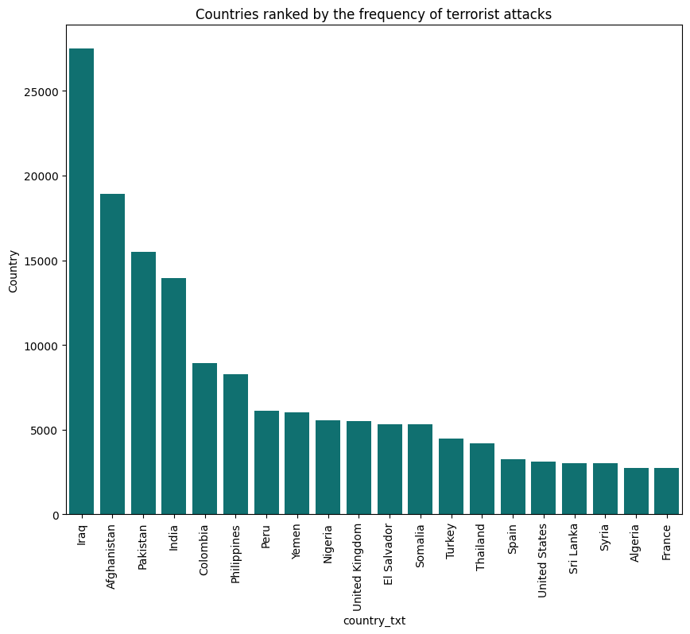
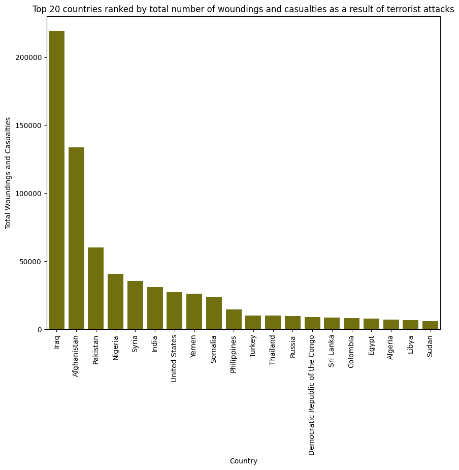

### Global Terrorism Database (GTD)

[Terrorism, in its broadest sense, is the use of violence against non-combatants to achieve political or ideological aims.](https://en.wikipedia.org/wiki/Terrorism#:~:text=Terrorism%2C%20in%20its%20broadest%20sense%2C%20is%20the%20use%20of%20violence%20against%20non%2Dcombatants%20to%20achieve%20political%20or%20ideological%20aims.)  

The [Global Terrorism Database (GTD)](https://www.start.umd.edu/download-global-terrorism-database) provides a comprehensive record of terrorist attacks worldwide from 1970 to 2020. It includes detailed information across 135 columns, such as the number of casualties, weapon types, target profiles, and the ideological or political motivations behind each attack.  

### Defining Terrorism Hotspots

The dataset has been widely used to identify and rank countries as terrorism hotspots. However, the term *terrorism hotspot* can be defined in multiple ways, each depending on the specific analytical goals and criteria applied.

In this study—focused on the research question:  
**“Does terrorism increase before political instability rises, or does political instability lead to more terrorism?”**—a *terrorism hotspot* is defined as:

> A geographic region (at the country level) that experiences a significantly high number of terrorist incidents over a defined time period, indicating sustained or recurrent terrorist activity.  

> In this study the time period of terrorist attacks was defined to be from 2000 to 2020.

### Choice of Metric: Frequency vs. Lethality

While one might intuitively consider *lethality* (i.e., the number of casualties) as the primary metric for identifying hotspots, this study prioritizes **frequency**—the number of recorded terrorist attacks per year.

This choice is grounded in several key observations:

- **Signal vs. Noise**: High-casualty events are rare and often unpredictable, introducing volatility. In contrast, attack frequency offers a more stable and consistent signal over time.
- **Political Correlation**: Frequency is more likely to reflect underlying political conditions or sustained campaigns, whereas lethality may hinge on outlier events.

Thus, using attack frequency allows for a more robust analysis of how terrorism and political instability may influence each other over time.  
  
  
  
In this regard, the dataset has been cleared- i.e, null values are imputed- the necessary informations are filtered out, and from finally two important set of information have been extracted:
1. Top 20 countries ranked by the frequency of the terrorist attacks between the years 2000 and 2020.
    These top 20 countries are identified to be the Terrorism Hotspots.

2. Top 20 Countries ranked by the total number of woundings and casualties as a result of terrorist attacks between the years 2000 and 2020.
    This set of data is extracted in case it is needed in the further steps of the analysis.

The findings can be seen below:  

### Top 20 countries ranked by the frequency of the terrorist attacks between the years 2000 and 2020

| Rank | Country           | Total Attacks |
|------|-------------------|----------------|
| 1    | Iraq              | 27,521         |
| 2    | Afghanistan       | 18,920         |
| 3    | Pakistan          | 15,504         |
| 4    | India             | 13,929         |
| 5    | Colombia          | 8,915          |
| 6    | Philippines       | 8,271          |
| 7    | Peru              | 6,111          |
| 8    | Yemen             | 6,027          |
| 9    | Nigeria           | 5,550          |
| 10   | United Kingdom    | 5,513          |
| 11   | El Salvador       | 5,320          |
| 12   | Somalia           | 5,317          |
| 13   | Turkey            | 4,485          |
| 14   | Thailand          | 4,201          |
| 15   | Spain             | 3,255          |
| 16   | United States     | 3,121          |
| 17   | Sri Lanka         | 3,041          |
| 18   | Syria             | 2,997          |
| 19   | Algeria           | 2,753          |
| 20   | France            | 2,751          |

### Top 20 Countries ranked by the total number of woundings and casualties as a result of terrorist attacks between the years 2000 and 2020

| Rank | Country                             | Total Collateral |
|------|-------------------------------------|------------------|
| 1    | Iraq                                | 219,159          |
| 2    | Afghanistan                         | 133,556          |
| 3    | Pakistan                            | 60,319           |
| 4    | Nigeria                             | 40,846           |
| 5    | Syria                               | 35,376           |
| 6    | India                               | 30,834           |
| 7    | United States                       | 27,284           |
| 8    | Yemen                               | 26,134           |
| 9    | Somalia                             | 23,610           |
| 10   | Philippines                         | 14,707           |
| 11   | Turkey                              | 10,096           |
| 12   | Thailand                            | 9,918            |
| 13   | Russia                              | 9,783            |
| 14   | Democratic Republic of the Congo    | 8,973            |
| 15   | Sri Lanka                           | 8,724            |
| 16   | Colombia                            | 8,291            |
| 17   | Egypt                               | 8,000            |
| 18   | Algeria                             | 7,049            |
| 19   | Libya                               | 6,757            |
| 20   | Sudan                               | 6,069            |

