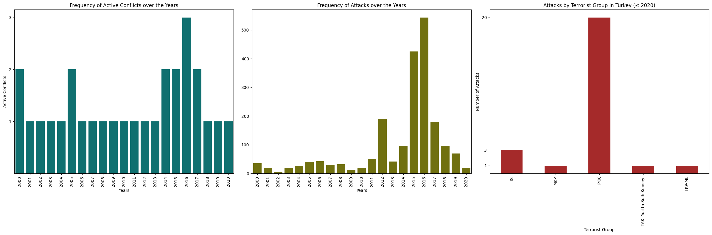

## Uppsala Conflict Data Program (UCDP) Findings

Initially, the research plan involved using both the Uppsala Conflict Data Program (UCDP) and the Global Terrorism Database (GTD) in tandem to identify terrorism hotspots and analyze their relationship with political instability. The idea was that combining these datasets would provide a broader and more nuanced understanding of both terrorist activity and conflict-related instability.  

However, after conducting exploratory data analysis (EDA) on both datasets, it was determined that the frequency of terrorist attacks, as measured by the GTD, is a sufficient and more targeted metric for identifying terrorism hotspots for the scope of this research.  

That said, the UCDP remains a valuable resource for a different dimension of the study.  

UCDP could potentially help detect sharp spikes or drops in violent events — which may correspond to rapid political changes or ceasefires — these are more likely to represent sudden contextual shifts rather than gradual trends of instability. As such, they are less aligned with the goal of identifying consistent terrorism hotspots.

## Analysis of Turkey

Given the large size of the datasets involved and the time constraints imposed by the academic term, it was deemed necessary to narrow the scope of the research to ensure both depth and feasibility of analysis.

Instead of analyzing all 20 countries identified as terrorism hotspots based on GTD data (2000–2020), a subset of 5 countries was selected at random from this group for a more focused investigation aimed at answering the primary research question

One of the randomly selected countries is Turkey. This case study will serve as a representative example for understanding the dynamics between terrorism and political instability.  

The below findings related to Turkey were extracted from the UCDP dataset using a custom Python script developed specifically for this purpose. 

### Conflicts That Started In 2000 - 2023

|     | side_a              | side_b | year | start_date | ep_end | ep_end_date | intensity_level | type_of_conflict | conflict_id |
|-----|---------------------|--------|------|------------|--------|--------------|------------------|-------------------|-------------|
| 175 | Government of Turkey | IS     | 2015 | 2015-07-23 | 0      | NaT          | 1                | 3                 | 13902       |
| 176 | Government of Turkey | IS     | 2016 | 2015-07-23 | 0      | NaT          | 2                | 3                 | 13902       |
| 177 | Government of Turkey | IS     | 2017 | 2015-07-23 | 1      | 2017-09-06   | 1                | 3                 | 13902       |

### Conflicts That Ended in 2000 - 2023

|      | side_a              | side_b                  | year | start_date | ep_end | ep_end_date | intensity_level | type_of_conflict | conflict_id |
|------|---------------------|--------------------------|------|------------|--------|--------------|------------------|-------------------|-------------|
| 2332 | Government of Turkey | TKP-ML                  | 2000 | 1987-12-31 | 1      | 2000-12-12   | 1                | 3                 | 383         |
| 2333 | Government of Turkey | MKP                     | 2005 | 1987-12-31 | 1      | 2005-10-17   | 1                | 3                 | 383         |
| 2159 | Government of Turkey | PKK                     | 2013 | 1983-05-01 | 1      | 2013-03-12   | 1                | 3                 | 354         |
| 2334 | Government of Turkey | TAK, Yurtta Sulh Konseyi | 2016 | 1987-12-31 | 1      | 2016-12-17   | 1                | 3                 | 383         |
| 177  | Government of Turkey | IS                      | 2017 | 2015-07-23 | 1      | 2017-09-06   | 1                | 3                 | 13902       |

### Conflicts that did not end sometime in 2000 - 2023

|    | side_a              | side_b | year | start_date | ep_end | ep_end_date | intensity_level | type_of_conflict | conflict_id |
|----|---------------------|--------|------|------------|--------|--------------|------------------|------------------|-------------|
| 2146 | Government of Turkey | PKK    | 2000 | 1983-05-01 | 0      | NaT          | 1                | 3                | 354         |
| 2147 | Government of Turkey | PKK    | 2001 | 1983-05-01 | 0      | NaT          | 1                | 3                | 354         |
| 2148 | Government of Turkey | PKK    | 2002 | 1983-05-01 | 0      | NaT          | 1                | 3                | 354         |
| 2149 | Government of Turkey | PKK    | 2003 | 1983-05-01 | 0      | NaT          | 1                | 3                | 354         |
| 2150 | Government of Turkey | PKK    | 2004 | 1983-05-01 | 0      | NaT          | 1                | 3                | 354         |
| 2151 | Government of Turkey | PKK    | 2005 | 1983-05-01 | 0      | NaT          | 1                | 3                | 354         |
| 2152 | Government of Turkey | PKK    | 2006 | 1983-05-01 | 0      | NaT          | 1                | 3                | 354         |
| 2153 | Government of Turkey | PKK    | 2007 | 1983-05-01 | 0      | NaT          | 1                | 3                | 354         |
| 2154 | Government of Turkey | PKK    | 2008 | 1983-05-01 | 0      | NaT          | 1                | 3                | 354         |
| 2155 | Government of Turkey | PKK    | 2009 | 1983-05-01 | 0      | NaT          | 1                | 3                | 354         |
| 2156 | Government of Turkey | PKK    | 2010 | 1983-05-01 | 0      | NaT          | 1                | 3                | 354         |
| 2157 | Government of Turkey | PKK    | 2011 | 1983-05-01 | 0      | NaT          | 1                | 3                | 354         |
| 2158 | Government of Turkey | PKK    | 2012 | 1983-05-01 | 0      | NaT          | 1                | 3                | 354         |
| 175  | Government of Turkey | IS     | 2015 | 2015-07-23 | 0      | NaT          | 1                | 3                | 13902       |
| 2160 | Government of Turkey | PKK    | 2015 | 1983-05-01 | 0      | NaT          | 1                | 3                | 354         |
| 2161 | Government of Turkey | PKK    | 2016 | 1983-05-01 | 0      | NaT          | 2                | 3                | 354         |
| 176  | Government of Turkey | IS     | 2016 | 2015-07-23 | 0      | NaT          | 2                | 3                | 13902       |
| 2162 | Government of Turkey | PKK    | 2017 | 1983-05-01 | 0      | NaT          | 1                | 3                | 354         |
| 2163 | Government of Turkey | PKK    | 2018 | 1983-05-01 | 0      | NaT          | 1                | 3                | 354         |
| 2164 | Government of Turkey | PKK    | 2019 | 1983-05-01 | 0      | NaT          | 1                | 3                | 354         |
| 2165 | Government of Turkey | PKK    | 2020 | 1983-05-01 | 0      | NaT          | 1                | 3                | 354         |
| 2166 | Government of Turkey | PKK    | 2021 | 1983-05-01 | 0      | NaT          | 1                | 3                | 354         |
| 2167 | Government of Turkey | PKK    | 2022 | 1983-05-01 | 0      | NaT          | 1                | 3                | 354         |
| 2168 | Government of Turkey | PKK    | 2023 | 1983-05-01 | 0      | NaT          | 1                | 3                | 354         |

### Active Conflicts and Frequency of Attacks in 2000 - 2020

| Year | Active Conflicts | Frequency of Attacks |
|------|------------------|----------------------|
| 2000 | 2                | 35                   |
| 2001 | 1                | 19                   |
| 2002 | 1                | 5                    |
| 2003 | 1                | 19                   |
| 2004 | 1                | 27                   |
| 2005 | 2                | 41                   |
| 2006 | 1                | 43                   |
| 2007 | 1                | 30                   |
| 2008 | 1                | 32                   |
| 2009 | 1                | 13                   |
| 2010 | 1                | 20                   |
| 2011 | 1                | 51                   |
| 2012 | 1                | 190                  |
| 2013 | 1                | 42                   |
| 2014 | 2                | 95                   |
| 2015 | 2                | 425                  |
| 2016 | 3                | 544                  |
| 2017 | 2                | 181                  |
| 2018 | 1                | 94                   |
| 2019 | 1                | 70                   |
| 2020 | 1                | 20                   |

